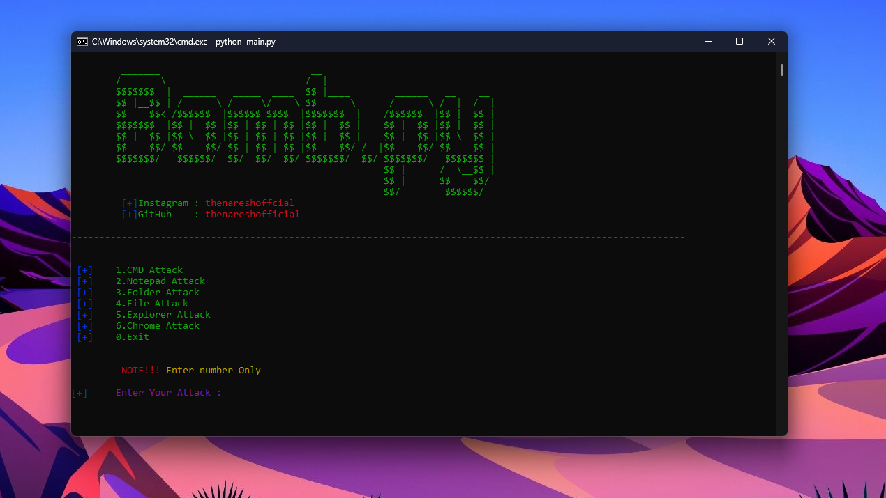

<p align=center>



<p align='center'>This Tool Developed By <br> <a herf="https://www.instagram.com/the_naresh_offcial/">@thenareshofficial</p>

## This Attack only on windows


## Installation

```console

#clone the repo
$git clone 

#change Directory Bomb.py
$cd Bomb.py

#Install the  Bomb.py requirements
$python3 -m install pip -r requirements.txt```
## Usage
### 1.CMD 
<p>The CMD(Command prompt) Attack is open a N number of CMD and crash a system.</p>

### 2.Notepad
<p>The Notepad Attack is open a N number of Notepad's and crash a system</p>

### 3. Folder
<p>The Folder Attack is Create a N number of folder's in C:/Windows</p>

### 4.File
<p>The File Attack is Open a N number of file's in c:/Windows</p>

### 5.Explorer
<p>The Explorer Attack is Open a N number of Explorer's</p>

### 6.Chrome
<p>The Chrome Attack is Open a N number of Chrome window's</p>

<h1 align='center'><u>ThankYou</u></h1>

